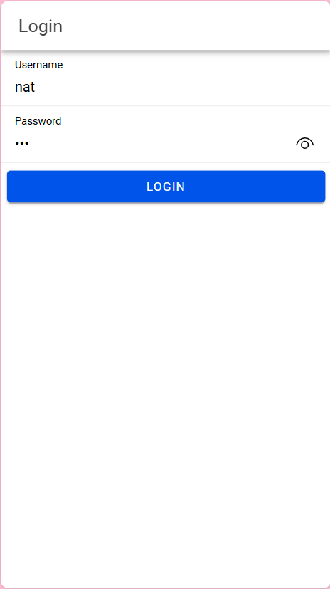
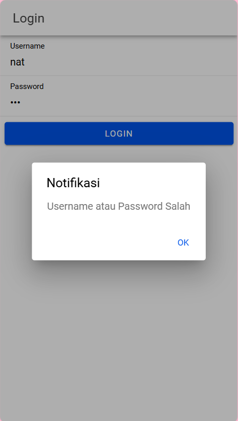
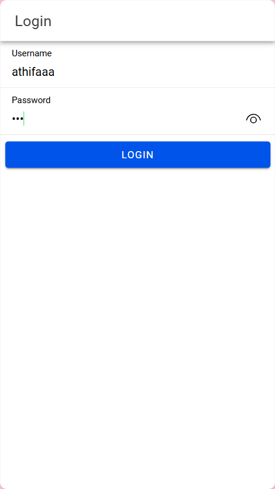
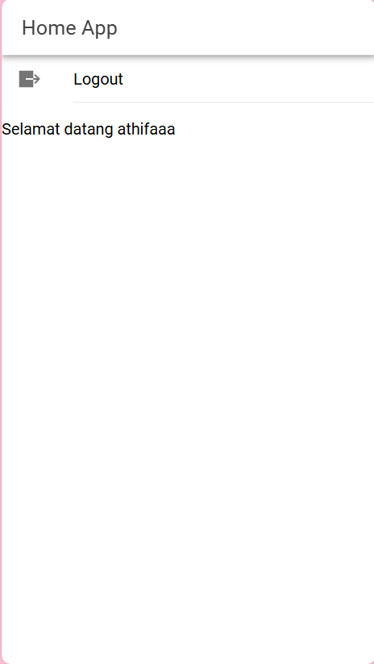

#### Nama       : Athifa Nathania  
#### NIM        : H1D022031  
#### Shift Baru : F
#### Shift Lama : D

---
# Tugas 7 - Cara Kerja Login Aplikasi Ionic

## 1. Pembuatan Data User di Database

Proses login dimulai dengan memastikan bahwa data pengguna tersedia di dalam database MySQL. Data pengguna (username dan password yang di-hash dengan MD5) disimpan di dalam tabel `user`. 

**SQL untuk membuat tabel dan menambahkan user:**
```sql
CREATE TABLE user (
  username varchar(100) NOT NULL,
  password varchar(255) NOT NULL
);

INSERT INTO user (username, password) VALUES ('athifaaa', MD5('123'));
```

- *Penjelasan*: Data user dengan password yang di-hash (`MD5`) disimpan di database. Pada proses login, hash ini akan dibandingkan dengan hash dari input password.

---

## 2. Koneksi ke Database (`koneksi.php`)

File `koneksi.php` digunakan untuk menghubungkan PHP dengan database MySQL.

**Kode utama koneksi:**
```php
<?php
header('Access-Control-Allow-Origin: *');
$con = mysqli_connect('localhost', 'root', '', 'coba-ionic') or die("koneksi gagal");
?>
```

- *Penjelasan*: Dengan koneksi ini, file PHP lain (seperti `login.php`) dapat melakukan query ke database `coba-ionic` untuk mendapatkan data user.

---

## 3. Verifikasi Data Login di API (`login.php`)

File `login.php` digunakan untuk memproses permintaan login dari aplikasi Ionic, memverifikasi username dan password yang diterima, dan mengirimkan status login kembali ke aplikasi.

**Kode utama login:**
```php
<?php
require 'koneksi.php';
$input = file_get_contents('php://input');
$data = json_decode($input, true);
$username = trim($data['username']);
$password = md5(trim($data['password']));
$query = mysqli_query($con, "SELECT * FROM user WHERE username='$username' AND password='$password'");
$jumlah = mysqli_num_rows($query);

if ($jumlah != 0) {
    $value = mysqli_fetch_object($query);
    $pesan['username'] = $value->username;
    $pesan['token'] = time() . '_' . $value->password;
    $pesan['status_login'] = 'berhasil';
} else {
    $pesan['status_login'] = 'gagal';
}

echo json_encode($pesan);
```

- *Penjelasan*: 
  - `file_get_contents('php://input')`: Mengambil data JSON dari body request.
  - `md5(trim($data['password']))`: Melakukan hash password yang di-input user untuk dibandingkan dengan hash yang ada di database.
  - `mysqli_query($con, "SELECT...")`: Mengecek apakah username dan hash password cocok dengan data di database.
  - Jika cocok, `status_login` diatur menjadi `berhasil`, dan sebuah token (kombinasi timestamp dan password) dikirim sebagai tanda autentikasi.
  - Jika tidak cocok, `status_login` diatur menjadi `gagal`.

---

## 4. Proses Login di Aplikasi Ionic (`login.page.ts`)

Di aplikasi Ionic, halaman `login.page.ts` berfungsi untuk menerima input dari user dan mengirimkannya ke API login (`login.php` di server).

**Kode utama login di Ionic:**
```typescript
import { AuthenticationService } from '../services/authentication.service';

export class LoginPage {
  username: any;
  password: any;

  constructor(private authService: AuthenticationService) { }

  login() {
    if (this.username && this.password) {
      const data = { username: this.username, password: this.password };
      this.authService.postMethod(data, 'login.php').subscribe(res => {
        if (res.status_login == "berhasil") {
          this.authService.saveData(res.token, res.username);
        } else {
          this.authService.notifikasi('Username atau Password Salah');
        }
      });
    } else {
      this.authService.notifikasi('Username atau Password Tidak Boleh Kosong');
    }
  }
}
```

- *Penjelasan*: 
  - `this.authService.postMethod(data, 'login.php')`: Mengirimkan data `username` dan `password` ke `login.php` menggunakan `postMethod`.
  - Jika `status_login` dari API adalah `berhasil`, maka data token disimpan melalui `saveData`, yang mengindikasikan bahwa user sudah berhasil login.
  - Jika gagal, notifikasi akan muncul.

---

## 5. Penyimpanan Token dan Status Login (`authentication.service.ts`)

Service `AuthenticationService` di Ionic menangani penyimpanan token login dan status autentikasi, serta metode untuk mengatur ulang (logout) atau memeriksa status login.

**Kode utama di `authentication.service.ts`:**
```typescript
import { Preferences } from '@capacitor/preferences';

export class AuthenticationService {
  isAuthenticated: BehaviorSubject<boolean> = new BehaviorSubject<boolean>(false);

  saveData(token: string, user: string) {
    Preferences.set({ key: 'auth-login', value: token });
    Preferences.set({ key: 'auth-user', value: user });
    this.isAuthenticated.next(true);
  }

  async loadData() {
    const token = await Preferences.get({ key: 'auth-login' });
    if (token && token.value) {
      this.isAuthenticated.next(true);
    } else {
      this.isAuthenticated.next(false);
    }
  }

  logout() {
    Preferences.remove({ key: 'auth-login' });
    Preferences.remove({ key: 'auth-user' });
    this.isAuthenticated.next(false);
  }
}
```

- *Penjelasan*: 
  - `saveData`: Menyimpan `token` dan `user` ke dalam storage lokal dan mengubah status `isAuthenticated` menjadi `true`.
  - `loadData`: Memeriksa token di storage saat aplikasi dibuka kembali; jika token ada, `isAuthenticated` akan diatur ke `true`.
  - `logout`: Menghapus token dari storage dan mengubah `isAuthenticated` menjadi `false`.

---

## 6. Proteksi Akses dengan Guards (`auth.guard.ts` dan `auto-login.guard.ts`)

Guards digunakan untuk memastikan bahwa user hanya dapat mengakses halaman tertentu jika sudah login.

**Kode utama di `auth.guard.ts`:**
```typescript
export const authGuard: CanActivateFn = () => {
  return inject(AuthenticationService).authenticationState.pipe(
    map(isAuthenticated => isAuthenticated ? true : inject(Router).navigateByUrl('/login'))
  );
};
```

**Kode utama di `auto-login.guard.ts`:**
```typescript
export const autoLoginGuard: CanActivateFn = () => {
  return inject(AuthenticationService).authenticationState.pipe(
    map(isAuthenticated => isAuthenticated ? inject(Router).navigateByUrl('/home') : true)
  );
};
```

- *Penjelasan*: 
  - `authGuard`: Mencegah user yang belum login mengakses halaman yang dilindungi; jika `isAuthenticated` false, user diarahkan ke halaman login.
  - `autoLoginGuard`: Jika user sudah login, guard ini akan mengarahkan mereka langsung ke halaman home.

---

## Ringkasan

1. **Database**: Menyimpan data user dengan password yang di-hash.
2. **API (`login.php`)**: Memproses login dengan memverifikasi data user dari request.
3. **Login Page (Ionic)**: Mengirim data user ke API dan menampilkan status login.
4. **Authentication Service**: Menyimpan token di perangkat, mengelola status login, dan menyediakan metode logout.
5. **Guards**: Mengatur akses halaman berdasarkan status autentikasi.

Dengan mengikuti proses ini, aplikasi Ionic dapat melakukan autentikasi user dengan PHP dan MySQL, menyimpan token, dan memastikan keamanan akses halaman dalam aplikasi.

# Hasil Aplikasi
## 1. Halaman Login
### Gagal
 

### Berhasil


### Halaman Home 

